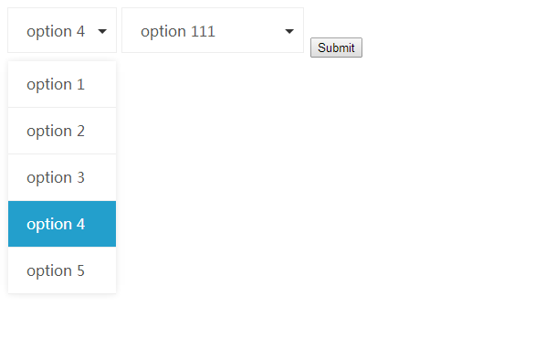
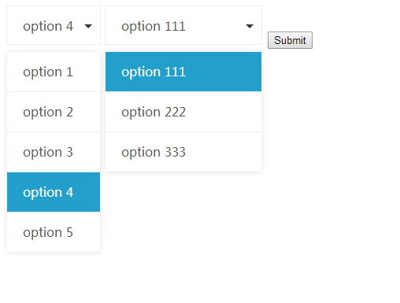

# Light Selector

## 介绍

一个可以定制 HTML 中的 `select` 标签的小插件。支持动态调整整个元素的大小。

## 为什么要写这个插件？

Light Selector 的诞生纯属无意，一开始是因为在写自己的博客的时候，用到的 `jquery.fs.selecter` 插件有点问题，样式全乱了，自己想着要不自己写一个。

然后用了大概三个多钟左右完成了现在的这个初始版本。现在的这个版本已经完全满足我的博客开发所需要的功能了。

## API

(暂时没时间写，请看代码研究一下吧。)

## 截图

