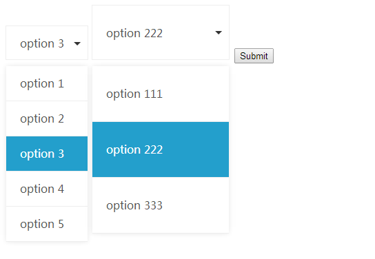

# Light Selector

## 介绍

一个可以定制 HTML 中的 `select` 标签的小插件。支持动态调整整个元素的大小。

## 如何使用

```html
<!DOCTYPE html>
<html lang="en">
<head>
    <meta charset="UTF-8">
    <link rel="stylesheet" href="css/jquery.light-selector.css">
    <title>jQuery Light Selector</title>
</head>
<body>
    <form action="/">
        <select name="test1" id="" class="test1">
            <option value="1">option 1</option>
            <option value="2">option 2</option>
            <option value="3">option 3</option>
            <option value="4">option 4</option>
            <option value="5">option 5</option>
        </select>

        <select name="test2" id="" class="test2">
            <option value="1">option 111</option>
            <option value="2">option 222</option>
            <option value="3">option 333</option>
        </select>
        <button type="submit">Submit</button>
    </form>

    <script type="text/javascript" src="js/jquery-2.1.1.min.js"></script>
    <script type="text/javascript" src="js/jquery.light-selector.js"></script>
    <script>
        var test1 = $('.test1').lightSelector();
        var test2 = $('.test2').lightSelector().setSize({
            width: 200,
            height: 80
        });
        $('button').on('click', function (event) {
            event.preventDefault();
            alert('selector 1 value: ' + $('select[name="test1"]').val() + ', selector 2 value: ' + $('select[name="test2"]').val());
        });
    </script>
</body>
</html>
```

在 HTML 中正确引入 `jQuery` 和 `jquery.light-selector.css` 和 `jquery.light-selector.js` 这三个文件，然后使用 jQuery 选择你要自定义的 `select` 标签，在这个 jQuery 对象后面调用 `lightSelector()` 这个方法即可。

## 为什么要写这个插件？

Light Selector 的诞生纯属无意，一开始是因为在写自己的博客的时候，用到的 `jquery.fs.selecter` 插件有点问题，样式全乱了，自己想着要不自己写一个。

然后用了大概三个多钟左右完成了现在的这个初始版本。现在的这个版本已经完全满足我的博客开发所需要的功能了。

## API

(暂时没时间写，请看代码研究一下吧。)

## 截图


